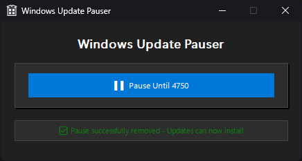

<div align="center">
 
### 👀 Repository Views


**⭐ If this tool helped you, please consider giving it a star! ⭐**

</div>

---

<p align="center">
 
</p>

<h2 align="center">Windows Update Pauser</h2>
<p align="center">Modern Windows Update Control Tool for Windows 10/11 — Now with ARM64 & UCRT</p>

<p align="center">
  
  <a href="https://github.com/EXLOUD/Windows-Update-Pauser/issues"></a>
  
  
  <a href="https://github.com/EXLOUD/Windows-Update-Pauser/blob/main/LICENSE"></a>
</p>

<p align="center">
  <a href="#-what-is-windows-update-pauser">What is it?</a> | <a href="#-features">Features</a> | <a href="#-how-to-use">How to use</a> | <a href="#-how-it-works">How it works</a> | <a href="#-building">Building</a>
</p>

---

## 🎯 What is Windows Update Pauser?

Windows Update Pauser is a modern, user-friendly Windows application designed to provide **complete, irreversible control** over Windows Updates. With its intuitive interface, it allows you to pause Windows Updates for **100 years**, or resume them instantly with just one click.

This v1.3.18 release introduces **native ARM64 support**, **UCRT runtime builds**, and a **deep registry lockdown** to fully disable Windows Update services, driver updates, and metadata fetching.

---

## ✨ Features

<details>
<summary>Click to expand features</summary>

### 🎨 User Experience
- **Modern Dark UI Interface** - Clean, card-based design with smooth animations
- **One-Click Toggle** - Simple pause/resume functionality with large buttons
- **Real-time Status Feedback** - Color-coded success/error messages with visual indicators
- **Sound Notifications** - Audio confirmation after successful operations

### 🔧 Technical Capabilities
- **Complete Update Coverage** - Handles both feature and quality updates
- **Deep Registry Lockdown** - Fully disables Windows Update, drivers, metadata, and services
- **ARM64 Native Support** - Runs natively on Snapdragon X Elite, Surface Pro X, etc.
- **UCRT & MSVCRT Builds** - Modern and legacy runtime compatibility
- **System Integration** - Automatically opens Windows Update settings after actions

### 🛡️ System Integration
- **Administrator Support** - Requires and handles elevated privileges properly
- **Windows Compatibility** - Full support for Windows 10 and 11 (x86, x64, ARM64)
- **Error Handling** - Graceful error management with user-friendly messages
- **Service Integration** - Disables "Update Health Service" and more

</details>

---

## 🚀 How to use?

### 4.1 Download Release (Recommended)

<details>
<summary>Click to expand</summary>

#### 4.1.1 Download

Download the latest **v1.3.18** release from [GitHub Releases](https://github.com/EXLOUD/Windows-Update-Pauser/releases).

#### 4.1.2 Installation

1. Extract the downloaded archive.
2. Choose the folder matching your system:
   - `-x86` → For 86-bit Intel/AMD
   - `-x64` → For 64-bit Intel/AMD
   - `-arm64` → For ARM64 devices (Surface Pro X, Snapdragon X Elite)
3. Run `WindowsUpdatePauser-x64.exe` (or `-x86.exe` / `-arm64.exe`) **as Administrator**.

#### 4.1.3 Usage

1. Launch the application as Administrator.
2. Click the **⏸️ Pause for 100 years** button to fully disable updates.
3. Click the **▶️ Resume Updates** button to restore default behavior.
4. Receive visual and audio feedback when operation completes.
5. Windows Update settings will open automatically after each action.

> **Note:** All builds are standalone. Only `libwinpthread-1.dll` is included for compatibility.

</details>

---

These settings block: driver updates, metadata fetching, update servers, auto-updates, OS upgrades, and the Update Health Service. 

---

## 💻 System Requirements

- **Operating System**: Windows 10/11 (64-bit or 32-bit, including ARM64)  
- **Architecture**: x86, x64, ARM64  
- **Privileges**: Administrator rights (required)  
- **Dependencies**: None (standalone .exe + `libwinpthread-1.dll`)  

---

## 🔨 Building

<details>
<summary>Click to expand building instructions</summary>

### Prerequisites
- LLVM-MinGW 20250910 (LLVM 21.1.1) — Download here  
  - `llvm-mingw-20250910-msvcrt-x86_64.zip`  
  - `llvm-mingw-20250910-ucrt-x86_64.zip`  
  - `llvm-mingw-20250910-ucrt-aarch64.zip` (for ARM64)  

### Required files in project root:
- `WUP.cpp`  
- `WUP.rc`  
- `Resource.h`  
- `icon.ico` (32x32)  
- `icon_small.ico` (16x16)  

### One-Click Build
Run `build-release.bat` to automatically generate 9 binaries:

```
├── msvcrt
│   ├── x64    → WindowsUpdatePauser-x64.exe + libwinpthread-1.dll
│   ├── x86    → WindowsUpdatePauser-x86.exe + libwinpthread-1.dll
│   └── arm64  → WindowsUpdatePauser-arm64.exe + libwinpthread-1.dll
└── ucrt
    ├── x64    → WindowsUpdatePauser-x64.exe + libwinpthread-1.dll
    ├── x86    → WindowsUpdatePauser-x86.exe + libwinpthread-1.dll
    └── arm64  → WindowsUpdatePauser-arm64.exe + libwinpthread-1.dll
```

Script validates all source files and compiler paths before starting. 

### Manual Build (Single Target)

```cmd
# For x64 UCRT build:
C:\llvm-mingw-ucrt\bin\x86_64-w64-mingw32-clang++.exe -target x86_64-w64-windows-gnu -D_WIN32_WINNT=0x0A00 -DUNICODE -D_UNICODE -O2 -m64 -o WindowsUpdatePauser.exe WUP.cpp -lcomctl32 -ldwmapi -luxtheme -lwinmm -lversion -lshcore -lshell32 -luser32 -lgdi32 -lkernel32 -Wl,-subsystem,windows -static-libgcc -static-libstdc++
```

</details>

---

## 🐛 Fixed in v1.3.18

- **C2102 "lvalue required" Error** — Fixed button hit-testing.  
- **Missing Icons in x86/ARM64** — Fixed resource compilation.  
- **Linker Error "undefined symbol: WinMain"** — Switched to WinMain(LPSTR) for MinGW compatibility.  
- **Registry Lockdown** — Added 15+ keys to fully disable Windows Update services.  

---

## ⚠️ Important Disclaimer

This software modifies the Windows registry to control update behavior. While designed to be safe and reversible, use it at your own risk. The authors are not responsible for any system damage, loss of updates, or security issues.

---

## 📄 License

The code is available under the **MIT license**.

---

## 👨‍💻 Author

<div align="center">

**EXLOUD**  
[GitHub](https://github.com/EXLOUD)  

Made with ❤️ for the Windows development community

</div>

<div align="center">

⭐ If you find this project helpful, please consider giving it a star! ⭐

</div>
