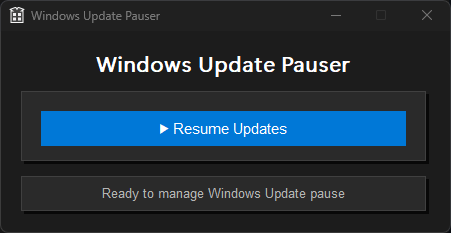

<div align="center">
 
### 👀 Repository Views


**⭐ If this tool helped you, please consider giving it a star! ⭐**

</div>

---

<p align="center">
 
 <h2 align="center">Windows Update Pauser</h2>
 <p align="center">Modern Windows Update Control Tool for Windows 10/11</p>
</p>

<p align="center">
  
  <a href="https://github.com/EXLOUD/Windows-Update-Pauser/issues"></a>
  
  
  <a href="https://github.com/EXLOUD/Windows-Update-Pauser/blob/main/LICENSE"></a>
</p>

<p align="center">
  <a href="#-what-is-windows-update-pauser">What is it?</a> | <a href="#-features">Features</a> | <a href="#-how-to-use">How to use</a> | <a href="#-how-it-works">How it works</a> | <a href="#-building">Building</a>
</p>

---

## 🎯 What is Windows Update Pauser?

Windows Update Pauser is a modern, user-friendly Windows application designed to provide complete control over Windows Updates. With its intuitive interface and powerful registry management, it allows you to pause Windows Updates until December 12, 4750, or resume them instantly with just one click.

Unlike complex group policy configurations or command-line tools, this application provides a visual interface with real-time feedback, sound notifications, and seamless integration with Windows Update settings.

## ✨ Features

<details>
<summary>Click to expand features</summary>

### 🎨 User Experience
- **Modern Dark UI Interface** - Clean, card-based design with smooth animations
- **One-Click Toggle** - Simple pause/resume functionality with large buttons
- **Real-time Status Feedback** - Color-coded success/error messages with visual indicators
- **Sound Notifications** - Audio confirmation after successful operations

### 🔧 Technical Capabilities
- **Long-term Pause Control** - Pauses updates until December 12, 4750 (~2000 years)
- **Complete Update Coverage** - Handles both feature and quality updates
- **Registry Management** - Safe and reliable Windows registry modifications
- **System Integration** - Automatically opens Windows Update settings after actions

### 🛡️ System Integration
- **Administrator Support** - Requires and handles elevated privileges properly
- **Windows Compatibility** - Full support for Windows 10 and 11
- **Error Handling** - Graceful error management with user-friendly messages
- **Service Integration** - Works with Windows Update service seamlessly

</details>

## 🚀 How to use?

There are several ways to use Windows Update Pauser:

- [Download from Releases](#41-download-release)
- [Build from Source](#42-build-from-source)

### 4.1 Download Release

<details>
<summary>Click to expand</summary>

The easiest way to get started is to download the pre-built executable.

#### 4.1.1 Download

**Download** the latest release from [GitHub Releases](https://github.com/EXLOUD/Windows-Update-Pauser/releases).

#### 4.1.2 Installation

1. **Extract** the downloaded archive
2. **Run** the executable as Administrator (required)
3. **Start** controlling your Windows Updates!

#### 4.1.3 Usage

1. **Launch** the application as Administrator
2. **Click** the **⏸️ Pause Until 4750** button to pause updates
3. **Click** the **▶️ Resume Updates** button to resume updates
4. **Receive** visual and audio feedback when operation completes
5. **Windows Update settings** will open automatically after each action

</details>

### 4.2 Build from Source

<details>
<summary>Click to expand</summary>

Since this repository contains source files without project files, you'll need to create a new project and integrate the code.

#### 4.2.1 Prerequisites

1. **Visual Studio 2019 or later** - Required for building the project
2. **Windows SDK** - For Windows API compatibility
3. **Required Libraries** - comctl32.lib, dwmapi.lib, uxtheme.lib, winmm.lib, version.lib

#### 4.2.2 Build Steps

**Method 1: Create New Project**
```bash
# Clone the repository
git clone https://github.com/EXLOUD/Windows-Update-Pauser.git
cd Windows-Update-Pauser

# Create a new Win32 GUI project in Visual Studio
# Copy the source files to your project directory
# Configure project settings and libraries
```

**Method 2: Manual Integration**
1. **Create** a new Win32 Application project in Visual Studio
2. **Copy** the following files to your project directory:
   - `UnifiedWindowsUpdateControl.cpp`
   - `resource.h`
   - `Resource.rc`
   - `icon.ico` (32x32)
   - `icon_small.ico` (16x16)
3. **Add** the files to your project
4. **Configure** linker dependencies:
   - comctl32.lib
   - dwmapi.lib
   - uxtheme.lib
   - winmm.lib
   - version.lib
5. **Build** in Release mode

#### 4.2.3 Project Configuration

Make sure your project has these settings:
- **Configuration Type**: Application (.exe)
- **Platform Toolset**: v142 or later
- **Windows SDK Version**: 10.0 or later
- **Character Set**: Unicode

#### 4.2.4 Run

1. Build the project in Visual Studio (Release mode)
2. Navigate to your output directory
3. Run the executable as Administrator (required)

</details>

## 🔧 How it works

The application modifies specific Windows registry values to control update behavior with precision and reliability.

### 4.3 Registry Keys Used

| Registry Path | Purpose |
|---------------|---------|
| `HKEY_LOCAL_MACHINE\SOFTWARE\Microsoft\WindowsUpdate\UX\Settings` | Main update control settings |
| `PauseUpdatesExpiryTime` | General pause expiration |
| `PauseFeatureUpdatesEndTime` | Feature updates pause end |
| `PauseQualityUpdatesEndTime` | Quality updates pause end |
| `PauseFeatureUpdatesStartTime` | Feature updates pause start |
| `PauseQualityUpdatesStartTime` | Quality updates pause start |
| `FlightSettingsMaxPauseDays` | Maximum pause duration |

### 4.4 Operation Logic

The application handles update control through two main operations:

**When Pausing:**
- Sets expiration date to December 12, 4750
- Records current time as start time
- Configures all update types (feature and quality)

**When Resuming:**
- Clears all pause-related registry values
- Restores default Windows Update behavior
- Removes all timing restrictions

## 💻 System Requirements

| Component | Requirement |
|-----------|-------------|
| **Operating System** | Windows 10/11 |
| **Architecture** | x86, x64 |
| **Privileges** | Administrator rights (required) |
| **Dependencies** | Windows Update service |

## 🔨 Building

<details>
<summary>Click to expand building instructions</summary>

### Prerequisites

Make sure you have the following installed:

- Visual Studio 2019 or later
- Windows SDK
- Required icon files (32x32 and 16x16)

### Project Structure

```
WindowsUpdatePauser/
├── src/                           # Source files (copy these to your project)
│   ├── UnifiedWindowsUpdateControl.cpp  # Main application logic
│   ├── resource.h                 # Resource definitions
│   └── Resource.rc                # Resource file
├── assets/                        # Images and icons
│   ├── icon.ico                   # Main icon (32x32)
│   ├── icon_small.ico             # Small icon (16x16)
│   └── preview.png                # Preview image
├── bin/                           # Build output
├── LICENSE                        # MIT License
└── README.md                      # This file
```

### Build Configuration

The project requires these settings:
- **Target Platform**: Windows 10/11
- **Platform Targets**: x86, x64
- **Output Type**: Windows Application
- **Required Libraries**: comctl32.lib, dwmapi.lib, uxtheme.lib, winmm.lib, version.lib

### Creating Your Project

1. **Open** Visual Studio
2. **Create** new project → Win32 Application
3. **Choose** GUI application template
4. **Copy** source files from repository
5. **Configure** linker dependencies
6. **Build** in Release mode

</details>

## 🔧 Troubleshooting

Common issues and their solutions:

### 7.1 Common Issues

<details>
<summary>Failed to Apply Pause</summary>

**Possible causes:**
- Not running as Administrator
- Windows Update service not running
- Registry access denied
- Unsupported Windows version

**Solutions:**
- Run the application as Administrator
- Start Windows Update service
- Check UAC settings
- Verify Windows 10/11 compatibility

</details>

<details>
<summary>Registry Access Denied</summary>

**Possible causes:**
- Insufficient privileges
- Group Policy restrictions
- Security software interference

**Solutions:**
- Right-click → Run as Administrator
- Check Group Policy settings
- Temporarily disable security software
- Verify registry permissions

</details>

<details>
<summary>Build Errors</summary>

**Possible causes:**
- Missing libraries
- Incorrect project configuration
- Missing resource files

**Solutions:**
- Add all required .lib files to linker
- Check project settings (Unicode, x64/x86)
- Verify icon files are present
- Ensure Windows SDK is installed

</details>

### 7.2 Getting Help

If you encounter issues:

1. Check the [Issues](https://github.com/EXLOUD/Windows-Update-Pauser/issues) page
2. Search for existing solutions
3. Create a new issue with detailed information including:
   - Windows version and build
   - Visual Studio version
   - Build errors or runtime errors
   - Steps to reproduce

## 🤝 Contributing

### 8.1 Suggestions

If you encounter problems, you can report them on the [Issues](https://github.com/EXLOUD/Windows-Update-Pauser/issues) page. Many enthusiastic developers and GitHub users will help you.

This project welcomes contributions and suggestions. You can make suggestions in [Issues](https://github.com/EXLOUD/Windows-Update-Pauser/issues), or submit a pull request 😄

### 8.2 Development Workflow

1. **Fork** the repository
2. **Create** a feature branch (`git checkout -b feature/amazing-feature`)
3. **Test** on Windows 10/11
4. **Commit** your changes (`git commit -m 'Add amazing feature'`)
5. **Push** to the branch (`git push origin feature/amazing-feature`)
6. **Open** a Pull Request

---

## ⚠️ Important Disclaimer

This software modifies the **Windows registry** to control update behavior. While designed to be safe and reversible, use it **at your own risk**. The authors are **not responsible** for any system damage, loss of updates, or security issues

---

## 📄 License

The code is available under the [MIT license](https://github.com/EXLOUD/Windows-Update-Pauser/blob/main/LICENSE).

## 👨‍💻 Author

<div align="center">

**EXLOUD**

[](https://github.com/EXLOUD)

*Made with ❤️ for the Windows development community*

</div>

---

<div align="center">

**⭐ If you find this project helpful, please consider giving it a star! ⭐**

</div>
